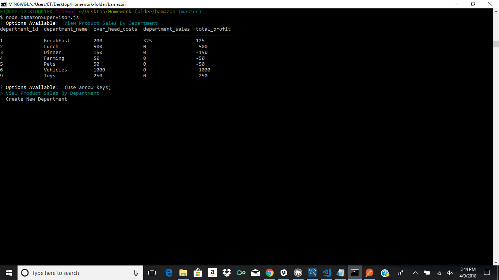
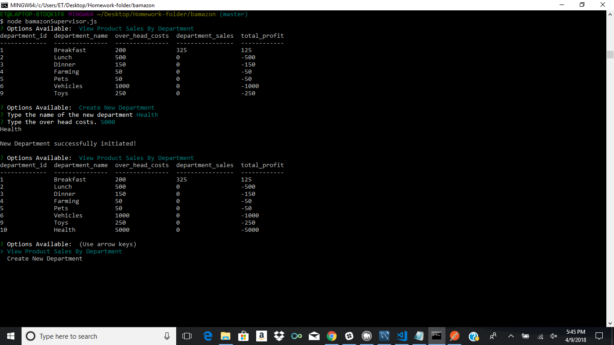

# bamazon
## bamazoncustomer.js
When bamazonCustomer.js is run in node a table tailored to customers appears and requests an item ID:

After the user inputs an item ID the program requests how many they would like:

Before we run this here is an image of the current database:

After running it console logs that the order was completed, the total price of the purchase, and resubmits the table and item_id query to fill more orders:

And the database has changed to reflect the loss of inventory:

If we request more of a product than there is available it stops the order and console logs "Insufficient Quantity!":

If we request an invalid item ID it throws an error:

## bamazonmanager.js
When bamazonmanger.js runs it presents 4 options.

View Products for sale logs a table for a manager in the console.

View Low inventory logs a list of all inventory with under 5 stock_quantity in console.

Add to inventory displays an array of existing items to choose from.

After selecting an item inquirer queries user for how much stock they would like to add. After submitting it logs that the order was placed successfully.

Selecting Add new product queries the user for the item name, department name, price and initial stock before creating the new product.

If we recheck Products For Sale our new item "Chocolate Bar" now exists in the database.

## bamazonsupervisor.js

If we run bamazonsupervisor.js we are given the options to view product sales by department or to create a new department.  If we view product sales:

If we create a new department we will be prompted by inquirer for the new department name and over head costs. Afterwards it will log that the new department is initiated. If we recheck our table the new department has been added.
